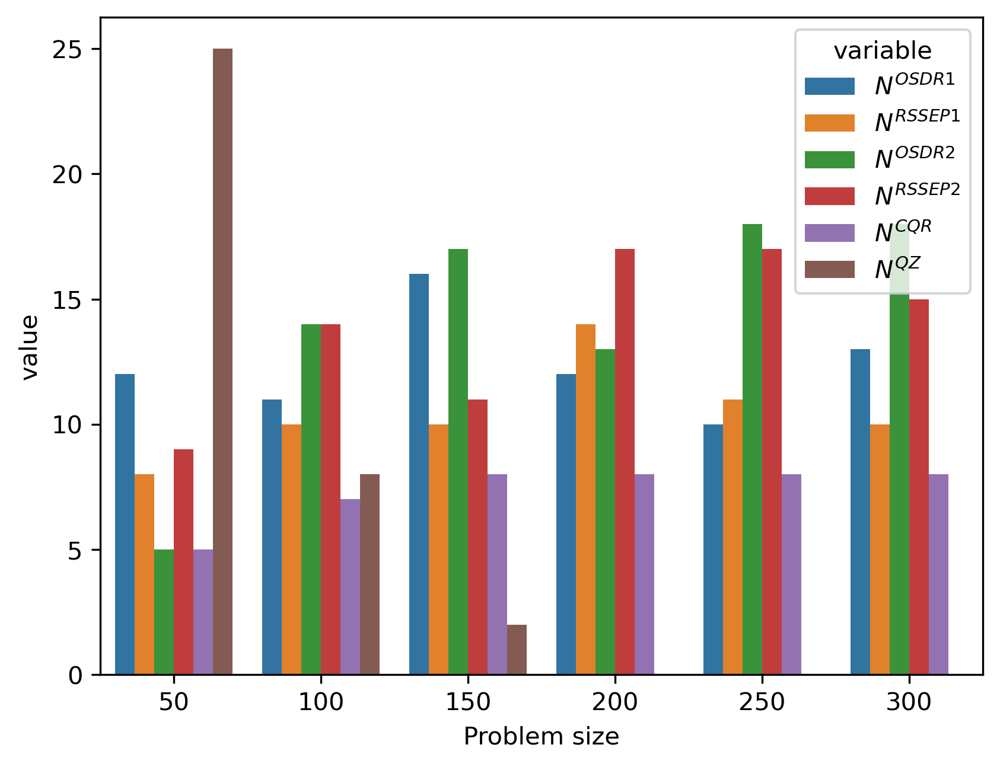

# Analysis and visualization of Example 5 from Symmetric-diagonal reductions paper using pandas and seaborn.

In this repository, we analyze one table produced in one of my research papers:

> **M. Ahmadnasab**,  
> *Symmetric-diagonal reductions as preprocessing for symmetric positive definite generalized eigenvalue solvers*,  
> *Journal of Mathematical Modeling*, Vol. 11, 2023, pp. 301–322.

---

## Example 5 Description

In this example, for each value of  
\( n \in \{50, 100, 150, 200, 250, 300\} \) (as the size of the problem),  
we consider 64 different problems. These problems are constituted by 8 different matrices **A** and 8 different matrices **B**, both generated 
by a MATLAB formula (function) which generate random SPD matrices with almost indicated condition number (1ek) and MODE: 

gallery('randsvd', n, -1e^k, MODE)

Here MODE = 3.  
The condition numbers of the matrices range from about **1e+1** to about **1e+15**.

We solve each problem with fixed **A** and **B** (each one of the 64 problems) by the following six methods:

- **OSDR1 method**
- **RSSEP1 method**
- **OSDR2 method**
- **RSSEP2 method**
- **CQR method**
- **QZ method**

Then, we compute:

\[
\eta_{\text{Mean}}^{\text{Min}} = \min\{\eta_{\text{Mean}}^{\text{OSDR1}}, \eta_{\text{Mean}}^{\text{RSSEP1}}, \eta_{\text{Mean}}^{\text{OSDR2}}, \eta_{\text{Mean}}^{\text{RSSEP2}}, \eta_{\text{Mean}}^{\text{CQR}}, \eta_{\text{Mean}}^{\text{QZ}}\} \quad (29)
\]

For each group of problems with a specific size **n** and a range of condition numbers from about **1e+1** to about **1e+15** (for **A**s and **B**s),  
the number of times that the \(\eta_{\text{Mean}}^{\text{method}}\) in (29) gives \(\eta_{\text{Mean}}^{\text{Min}}\) is denoted by **Nmethod**.

## Table 5 — Results Summary

The results for Example 5 are summarized in **Table 5**, showing  
\( N^{\text{OSDR1}}, N^{\text{RSSEP1}}, N^{\text{OSDR2}}, N^{\text{RSSEP2}}, N^{\text{CQR}}, \) and \( N^{\text{QZ}} \) versus the problem size \( n \):

| Problem size (n) | NOSDR1 | NRSSEP1 | NOSDR2 | NRSSEP2 | NCQR | NQZ |
|------------------:|:-----------------:|:------------------:|:-----------------:|:------------------:|:----------------:|:---------------:|
| 50  | 12 | 8  | 5  | 9  | 5 | 25 |
| 100 | 11 | 10 | 14 | 14 | 7 | 8  |
| 150 | 16 | 10 | 17 | 11 | 8 | 2  |
| 200 | 12 | 14 | 13 | 17 | 8 | 0  |
| 250 | 10 | 11 | 18 | 17 | 8 | 0  |
| 300 | 13 | 10 | 18 | 15 | 8 | 0  |

---

**Table 5** reports on \( N^{\text{OSDR1}}, N^{\text{RSSEP1}}, N^{\text{OSDR2}}, N^{\text{RSSEP2}}, N^{\text{CQR}}, N^{\text{QZ}} \) versus **n**.

When **n** changes from 50 to 300:
- \( N^{\text{CQR}} \) does not experience a meaningful change,
- \( N^{\text{QZ}} \) decreases from 25 to 0,
- \( N^{\text{OSDR1}} \) and \( N^{\text{RSSEP1}} \) (resp. \( N^{\text{OSDR2}} \) and \( N^{\text{RSSEP2}} \)) show competitive behaviors.

---

## Visualization of Results

The following chart visualizes the behavior, stability, and robustness of the new methods described above, in comparison with the Cholesky-QR and QZ methods:

## 📂 Code and Visualization

The code used to reproduce, analyze and visualize the  **Example 5**. 

