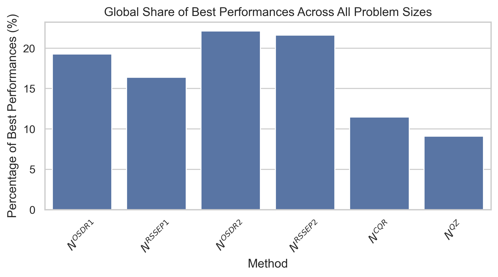
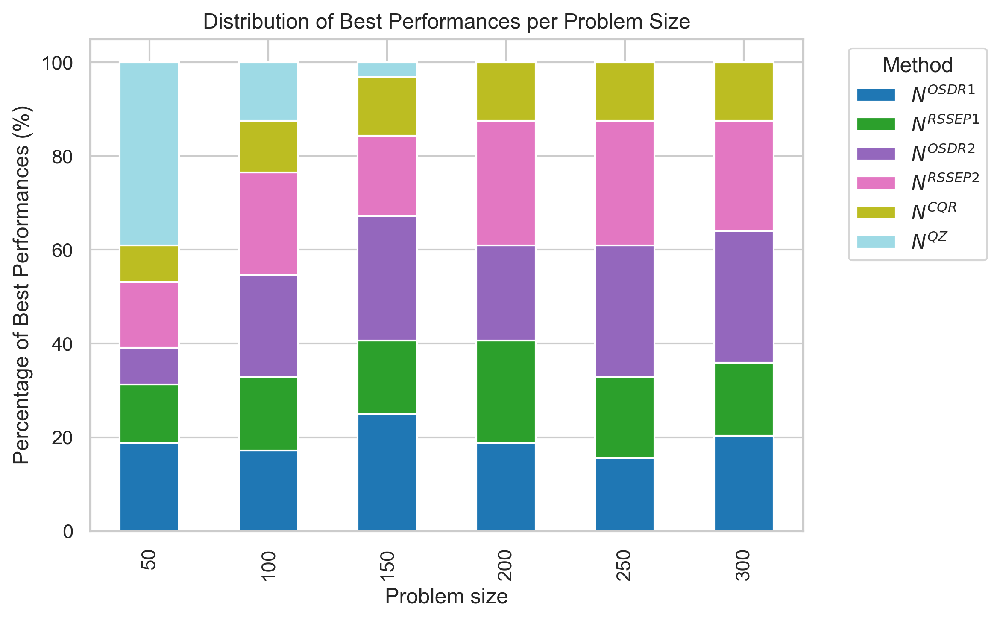

# Analysis and visualization of Example 5 from Symmetric-diagonal reductions paper using pandas and seaborn.

In this repository, we use Python’s pandas and seaborn libraries to analyze and visualize a dataset from my following research papers:
> **M. Ahmadnasab**,  
> *Symmetric-diagonal reductions as preprocessing for symmetric positive definite generalized eigenvalue solvers*,  
> *Journal of Mathematical Modeling*, Vol. 11, 2023, pp. 301–322.

---

## Example 5 Description

In this example, for each value of  
\( n \in \{50, 100, 150, 200, 250, 300\} \) (as the size of the problem),  
we consider 64 different problems. These problems are constituted by 8 different matrices **A** and 8 different matrices **B**, both generated 
by a MATLAB formula (function) which generate random SPD matrices with almost indicated condition number (1ek) and MODE: 

gallery('randsvd', n, -1e^k, MODE)

Here MODE = 3.  
The condition numbers of the matrices range from about **1e+1** to about **1e+15**.

We solve each problem with fixed **A** and **B** (each one of the 64 problems) by the following six methods:

- **OSDR1 method**
- **RSSEP1 method**
- **OSDR2 method**
- **RSSEP2 method**
- **CQR method**
- **QZ method**

Then, we compute:

\[
\eta_{\text{Mean}}^{\text{Min}} = \min\{\eta_{\text{Mean}}^{\text{OSDR1}}, \eta_{\text{Mean}}^{\text{RSSEP1}}, \eta_{\text{Mean}}^{\text{OSDR2}}, \eta_{\text{Mean}}^{\text{RSSEP2}}, \eta_{\text{Mean}}^{\text{CQR}}, \eta_{\text{Mean}}^{\text{QZ}}\} \quad (29)
\]

For each group of problems with a specific size **n** and a range of condition numbers from about **1e+1** to about **1e+15** (for **A**s and **B**s),  
the number of times that the \(\eta_{\text{Mean}}^{\text{method}}\) in (29) gives \(\eta_{\text{Mean}}^{\text{Min}}\) is denoted by **Nmethod**.

## Table 5 — Results Summary

The results for Example 5 are summarized in **Table 5**, showing  
\( N^{\text{OSDR1}}, N^{\text{RSSEP1}}, N^{\text{OSDR2}}, N^{\text{RSSEP2}}, N^{\text{CQR}}, \) and \( N^{\text{QZ}} \) versus the problem size \( n \):

| Problem size (n) | NOSDR1 | NRSSEP1 | NOSDR2 | NRSSEP2 | NCQR | NQZ |
|------------------:|:-----------------:|:------------------:|:-----------------:|:------------------:|:----------------:|:---------------:|
| 50  | 12 | 8  | 5  | 9  | 5 | 25 |
| 100 | 11 | 10 | 14 | 14 | 7 | 8  |
| 150 | 16 | 10 | 17 | 11 | 8 | 2  |
| 200 | 12 | 14 | 13 | 17 | 8 | 0  |
| 250 | 10 | 11 | 18 | 17 | 8 | 0  |
| 300 | 13 | 10 | 18 | 15 | 8 | 0  |

---

**Table 5** reports on \( N^{\text{OSDR1}}, N^{\text{RSSEP1}}, N^{\text{OSDR2}}, N^{\text{RSSEP2}}, N^{\text{CQR}}, N^{\text{QZ}} \) versus **n**.

When **n** changes from 50 to 300:
- \( N^{\text{CQR}} \) does not experience a meaningful change,
- \( N^{\text{QZ}} \) decreases from 25 to 0,
- \( N^{\text{OSDR1}} \) and \( N^{\text{RSSEP1}} \) (resp. \( N^{\text{OSDR2}} \) and \( N^{\text{RSSEP2}} \)) show competitive behaviors.

---
## After unpivoting the above table, we get this:

| Problem size | variable | value |
|-------------:|---------:|------:|
| 50           | 12       | 0    |
| 100          | 11       | 1    |
| 150          | 16       | 2    |
| 200          | 12       | 3    |
| 250          | 10       | 4    |
| 300          | 13       | 5    |
| 50           | 8        | 6    |
| 100          | 10       | 7    |
| 150          | 10       | 8    |
| 200          | 14       | 9    |
| 250          | 11       | 10   |
| 300          | 10       | 11   |
| 50           | 5        | 12   |
| 100          | 14       | 13   |
| 150          | 17       | 14   |
| 200          | 13       | 15   |
| 250          | 18       | 16   |
| 300          | 18       | 17   |
| 50           | 9        | 18   |
| 100          | 14       | 19   |
| 150          | 11       | 20   |
| 200          | 17       | 21   |
| 250          | 17       | 22   |
| 300          | 15       | 23   |
| 50           | 5        | 24   |
| 100          | 7        | 25   |
| 150          | 8        | 26   |
| 200          | 8        | 27   |
| 250          | 8        | 28   |
| 300          | 8        | 29   |
| 50           | 25       | 30   |
| 100          | 8        | 31   |
| 150          | 2        | 32   |
| 200          | 0        | 33   |
| 250          | 0        | 34   |
| 300          | 0        | 35   |

## Visualization of Results

The following chart visualizes the behavior, stability, and robustness of the new methods described above, in comparison with the Cholesky-QR and QZ methods:

## 📂 Code and Visualization

The code used to reproduce, analyze and visualize the  **Example 5**. 

### Analysis of Best Performances

Each number in the dataset represents how many times (out of 64 runs)
a given method achieved the minimum backward error for a given problem size.

#### Global Distribution
The following bar chart shows the **overall share of best performances** across all problem sizes.  
It summarizes which methods performed best most frequently over the entire set of problem instances.

=== Global percentage of best performances ===
$N^{OSDR1}$     19.27
$N^{RSSEP1}$    16.41
$N^{OSDR2}$     22.14
$N^{RSSEP2}$    21.61
$N^{CQR}$       11.46
$N^{QZ}$         9.11
dtype: float64

#### Distribution per Problem Size
The stacked bar chart below shows the **percentage of best performances for each method within each problem size**.  
This allows a detailed view of which methods dominate at specific problem sizes.

=== Per problem size percentages ===
  Problem size  $N^{OSDR1}$  $N^{RSSEP1}$  $N^{OSDR2}$  $N^{RSSEP2}$  \
0           50        18.75         12.50         7.81         14.06   
1          100        17.19         15.62        21.88         21.88   
2          150        25.00         15.62        26.56         17.19   
3          200        18.75         21.88        20.31         26.56   
4          250        15.62         17.19        28.12         26.56   
5          300        20.31         15.62        28.12         23.44   

   $N^{CQR}$  $N^{QZ}$  
0       7.81     39.06  
1      10.94     12.50  
2      12.50      3.12  
3      12.50      0.00  
4      12.50      0.00  
5      12.50      0.00  

  
